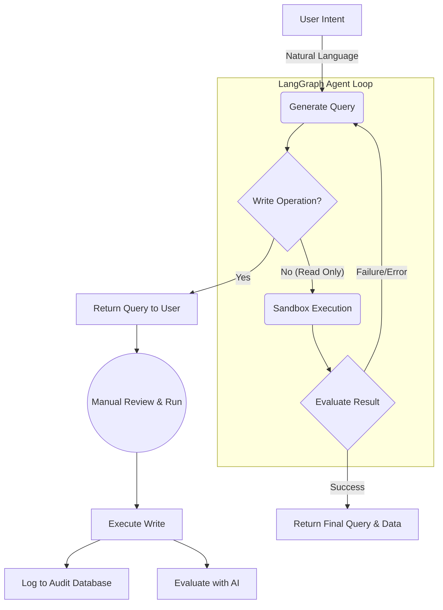
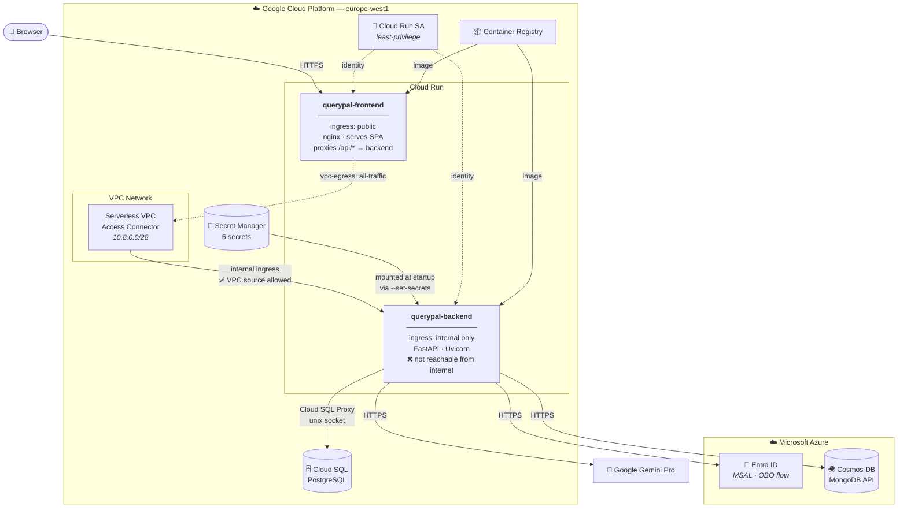
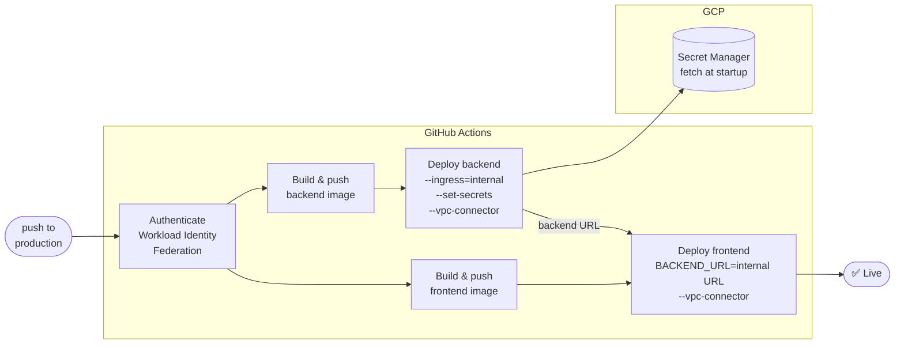

# QueryPal
### AI-Powered Database Assistant for Azure Cosmos DB

QueryPal is a highly scalable, intelligent database exploration and management platform designed for developers, analysts, and data professionals working with **Azure Cosmos DB (MongoDB API)**. It combines the power of **Google Gemini AI** with a secure, user-friendly interface to transform how you interact with your NoSQL databases.

**Key Capabilities:**
- 🧠 **Natural Language Queries**: Convert plain English to MongoDB queries using AI
- 📊 **AI-Powered Data Analysis**: Automatic insights and visualizations from query results
- 🔍 **Smart Data Explorer**: Paginated browsing with advanced filtering and search
- 💾 **Query Management**: Save, share, and collaborate on queries with team members
- 🔒 **Enterprise Security**: Microsoft Entra ID authentication with On-Behalf-Of (OBO) flow
- 📝 **Document Management**: Full CRUD operations with audit trails and history
- 🎯 **Schema Discovery**: Intelligent schema inference and documentation

---

## 🚀 Why QueryPal?

Azure Cosmos DB's portal interface can be limiting for real-world data exploration and analysis. QueryPal addresses these pain points by providing:

- **🎯 Intuitive Data Discovery**: Browse collections, analyze schemas, and understand your data structure without complex queries
- **🧠 AI-Powered Query Generation**: Ask questions in natural language and get optimized MongoDB queries instantly
- **📊 Intelligent Analytics**: Automatic data analysis with AI-generated insights and Chart.js visualizations
- **👥 Team Collaboration**: Share queries, insights, and findings with your team through built-in collaboration features
- **🛡️ Enterprise-Grade Security**: Zero-trust architecture with Microsoft Entra ID and secure token management
- **📋 Data Management**: Complete document lifecycle management with audit trails and version history
- **🔍 Advanced Search**: Powerful filtering and search capabilities across collections and documents

---

## ✨ Features
## 🎯 Key Features Deep Dive

### 🧠 AI-Powered Natural Language Queries
- **Smart Query Generation**: Convert plain English to optimized MongoDB queries
- **Context Awareness**: Uses database schema and collection metadata for better results
- **Query Optimization**: AI suggests performance improvements and best practices
- **Multi-step Queries**: Handle complex queries requiring multiple steps

### 📊 Intelligent Data Analysis
- **Automatic Insights**: AI analyzes query results and provides meaningful insights
- **Dynamic Visualizations**: Chart.js integration with 8+ chart types
- **Theme-Aware Charts**: Automatic dark/light mode adaptation
- **Export Capabilities**: Save query output for external analysis

### 💾 Team Collaboration & Query Management
- **Save & Share Queries**: Build a knowledge base of useful queries
- **Team Collaboration**: Share queries with specific team members
- **Version History**: Track query modifications and usage
- **Quick Access**: Organize and categorize saved queries

### 🔍 Advanced Data Explorer
- **Paginated Browsing**: Handle large collections efficiently
- **Smart Filtering**: Filter by any field with intelligent search
- **Document Linking**: Automatic cross-reference detection and navigation

### 📝 Document Management
- **Full CRUD Operations**: Create, read, update, delete documents
- **Audit Trails**: Complete history of document changes
- **Field-Level Editing**: Modify specific fields without affecting the whole document
- **Data Validation**: Ensure data integrity with schema validation

### 🎓 User Experience
- **Interactive Tutorial**: Guided onboarding for new users
- **Contextual Help**: In-app assistance and tooltips
- **Responsive Design**: Works seamlessly on desktop and mobile
- **Accessibility**: WCAG 2.1 compliant interface

---

## 🧱 Technology Stack

| Component           | Technology                                                                   |
|--------------------|-----------------------------------------------------------------------------|
| **Frontend**       | React 18, TypeScript, Vite, Tailwind CSS, Material-UI                     |
| **AI & Analytics** | Google Gemini Pro, Chart.js, React Chart.js 2                             |
| **Authentication** | Microsoft Entra ID, MSAL (Browser & Python), On-Behalf-Of Flow             |
| **Backend API**    | FastAPI (Python 3.12), Uvicorn, Pydantic V2                               |
| **Database**       | Azure Cosmos DB (MongoDB API), PostgreSQL (User Data)                      |
| **Cloud Platform** | Google Cloud Run, Azure Resource Manager (ARM)                             |
| **Infrastructure** | Terraform, GCP Secret Manager, Serverless VPC Access, Cloud SQL            |
| **DevOps & CI/CD** | GitHub Actions, Docker, Google Container Registry                          |
| **Testing**        | Vitest, React Testing Library, Pytest, Coverage.py                        |
| **Code Quality**   | ESLint, Black, Flake8, MyPy, TypeScript Strict Mode                       |
| **Monitoring**     | Application Insights, Cloud SQL Proxy, Logging                             |

---

## 🏗️ Architecture Overview

QueryPal follows a secure **Backend-for-Frontend (BFF)** pattern with enterprise-grade security:

```
┌─────────────────────┐     Auth       ┌─────────────────────┐
│    React Frontend   ├───────────────►│  Microsoft Entra    │
│   (SPA + MSAL.js)   │◄───────────────┤   Identity Platform │
└─────────────────────┘   Access Token └─────────────────────┘
           │
           ▼ Bearer Token
┌─────────────────────┐
│   FastAPI Backend   │
│  • Token Validation │
│  • OBO Exchange     │◄──────────┐
│  • Query Processing │           │
│  • AI Integration   │           │
│  • Document CRUD    │           │
└─────────────────────┘           │
           │                      │
           ▼                      │
┌─────────────────────┐           │
│  Google Gemini API  │           │
│  • NL2Query         │           │
│  • Data Analysis    │           │
│  • Insights Gen     │           │
└─────────────────────┘           │
                                  │
┌─────────────────────┐           │
│   PostgreSQL DB     │           │
│  • User Queries     │           │
│  • Audit Logs       │           │
│  • Query History    │           │
└─────────────────────┘           │
                                  │
┌─────────────────────┐           │
│  Azure Cosmos DB    │◄──────────┘
│  • Document Storage │
│  • MongoDB API      │
│  • ARM Management   │
└─────────────────────┘
```

### Autonomous Query Generation with ReAct Agent

QueryPal employs a powerful LangGraph-based ReAct (Reasoning and Acting) agent to autonomously generate, sandbox-test, and evaluate MongoDB queries. This ensures unparalleled accuracy while maintaining strict safety boundaries for write operations.



**Security Features:**
- ✅ **Zero-Trust Architecture**: No secrets stored in frontend
- 🔐 **Token-Based Authentication**: MSAL with automatic token refresh
- 🛡️ **On-Behalf-Of Flow**: Secure Azure resource access
- 🛡️ **Input Validation**: Comprehensive request/response validation
- 📝 **Audit Logging**: Complete audit trail for all operations

---


---

## Quick Start

### Option 1: Docker Compose (Recommended)

The fastest way to get QueryPal running locally:

```bash
# Clone the repository
git clone https://github.com/ChingEnLin/QueryPal
cd QueryPal

# Configure environment variables
cp backend/.env.example backend/.env
# Edit backend/.env with your API keys and Azure credentials

# Start both frontend and backend
docker-compose up --build

# Access the application
# Frontend: http://localhost:5173
# Backend API: http://localhost:8000
# API Documentation: http://localhost:8000/docs
```

### Option 2: Development Setup

For development with hot reload:

```bash
# Backend setup
cd backend
python -m venv venv
source venv/bin/activate  # or venv\Scripts\activate on Windows
pip install -r requirements.txt
cp .env.example .env  # Configure your environment variables
uvicorn main:app --reload

# Frontend setup (new terminal)
cd frontend
npm install
npm run dev
```

### Environment Configuration

Create a `backend/.env` file with:

```env
# Google Gemini API
GEMINI_API_KEY=your_gemini_api_key_here

# Azure Entra ID Configuration
AZURE_TENANT_ID=your_tenant_id
AZURE_CLIENT_ID=your_backend_app_id
AZURE_CLIENT_SECRET=your_client_secret
ARM_SCOPE=https://management.azure.com/.default

# PostgreSQL Database (for user data)
DB_USER=querypal_user
DB_PASS=your_db_password
DB_NAME=querypal
DB_HOST=localhost
DB_PORT=5432

# Optional: For production
DB_UNIX_SOCKET=/cloudsql/project:region:instance
```

---

## 🧪 Testing & Quality Assurance

QueryPal maintains high code quality with comprehensive testing:

### Backend Testing
```bash
cd backend

# Run all tests with coverage
./run_tests.sh

# Individual commands
pytest --cov=. --cov-report=html    # Tests with coverage
flake8 . --statistics                # Code linting
black --check .                      # Code formatting
mypy .                               # Type checking
```

### Frontend Testing
```bash
cd frontend

# Run all tests
npm test

# Run with coverage
npm run test:coverage

# Run tests once
npm run test:run

# Interactive UI testing
npm run test:ui
```

### Test Coverage
- **Backend**: 85%+ code coverage with pytest
- **Frontend**: 80%+ code coverage with Vitest
- **Integration Tests**: E2E testing of critical user flows
- **Static Analysis**: Type checking, linting, and formatting

### CI/CD Pipeline
- ✅ **Automated Testing**: All PRs trigger comprehensive test suites
- 🚀 **Deployment**: Automatic deployment to Google Cloud Run on production branch
- 📊 **Code Coverage**: Coverage reports uploaded to Codecov
- 🔍 **Code Quality**: ESLint, Black, MyPy, and TypeScript strict mode

---

## ☁️ Infrastructure & Deployment

### Production Architecture

QueryPal runs on Google Cloud Run with a private backend topology. The frontend nginx container is the only public entry point — the backend service is network-isolated and unreachable from the internet.



### Network Security Model

| | Frontend | Backend |
|---|---|---|
| **Cloud Run ingress** | `all` (public) | `internal` (VPC only) |
| **VPC egress** | `all-traffic` (proxy to backend) | `private-ranges-only` |
| **Internet accessible** | ✅ Yes | ❌ No — 403 from GFE |
| **Who can call it** | Anyone | Frontend nginx via VPC connector |

All API calls from the browser go to `/api/*` on the frontend's own origin. Nginx strips the `/api` prefix and proxies the request to the backend's internal Cloud Run URL through the VPC connector. The backend URL is never exposed to the browser.

### Secret Management

All sensitive configuration is stored in **GCP Secret Manager** and mounted into the backend container at startup via Cloud Run's native `--set-secrets` integration. Secrets are never passed as plain environment variables and never appear in deployment logs or `gcloud run describe` output.

| Secret | Description |
|---|---|
| `querypal-azure-tenant-id` | Microsoft Entra ID tenant |
| `querypal-azure-client-id` | Backend app registration client ID |
| `querypal-azure-client-secret` | Backend app registration client secret |
| `querypal-gemini-api-key` | Google Gemini API key |
| `querypal-db-user` | Cloud SQL PostgreSQL username |
| `querypal-db-pass` | Cloud SQL PostgreSQL password |

### Infrastructure as Code

Cloud infrastructure is managed by **Terraform** in the `terraform/` directory. The CI pipeline owns image builds and Cloud Run deployments; Terraform owns everything underneath.

| Resource | Managed by |
|---|---|
| VPC connector | Terraform |
| Secret Manager secrets | Terraform |
| Cloud Run service account + IAM | Terraform |
| Cloud SQL instance & database | Terraform (import existing) |
| Cloud Run services | CI pipeline (GitHub Actions) |
| Docker images | CI pipeline (GitHub Actions) |

```bash
cd terraform
cp terraform.tfvars.example terraform.tfvars
terraform init
./import.sh      # import existing Cloud SQL — no data migration needed
terraform apply
```

> See the PR migration guide for the full step-by-step checklist, including how to populate Secret Manager values and what to verify before the first production deploy.

### CI/CD Pipeline

Pushes to the `production` branch trigger the deploy workflow (`.github/workflows/google-cloudrun-docker.yml`).



Workload Identity Federation is used for keyless authentication — no long-lived service account keys are stored in GitHub. The dedicated Cloud Run service account (`querypal-cloudrun-sa`) holds only the permissions it needs: `secretmanager.secretAccessor`, `cloudsql.client`, and `vpcaccess.user`.

---

## 🔧 Development Setup

### Prerequisites
- **Node.js** 20+ and npm
- **Python** 3.12+
- **Docker** and Docker Compose
- **Google Cloud SDK** (for deployment)
- **Azure CLI** (optional, for Azure resources)

### IDE Recommendations
- **VS Code** with extensions:
  - Python
  - TypeScript
  - Pylance
  - Prettier
  - ESLint
  - Docker

---

## ⚙️ Azure Setup & Configuration

### 1. Microsoft Entra ID Application Registration

**Frontend Application (SPA):**
1. Go to [Azure Portal → App Registrations](https://portal.azure.com/#blade/Microsoft_AAD_RegisteredApps)
2. Create new registration:
   - **Name**: `QueryPal Frontend`
   - **Platform**: Single-page application (SPA)
   - **Redirect URI**: `http://localhost:5173` (development) / your production URL
3. Note the **Application (client) ID** and **Directory (tenant) ID**

**Backend Application (Confidential Client):**
1. Create another registration:
   - **Name**: `QueryPal Backend`
   - **Client type**: Confidential client
2. Add a **client secret** (Certificates & secrets)
3. **Expose an API**:
   - Add scope: `api://[backend-client-id]/access_as_user`
   - Add the frontend app as an authorized client

**API Permissions:**
- Add permissions for both apps:
  - `Microsoft Graph` → `User.Read`
  - `Azure Service Management` → `user_impersonation`
- **Grant admin consent** for your organization

### 2. Azure Cosmos DB Permissions

Grant the backend application appropriate access:
1. Go to your **Cosmos DB account** → **Access control (IAM)**
2. Add role assignment:
   - **Role**: `Cosmos DB Account Reader Role`
   - **Assign access to**: Service principal
   - **Select**: Your backend application

### 3. Frontend Configuration

Update `frontend/authConfig.ts`:

```typescript
export const msalConfig = {
  auth: {
    clientId: "your-frontend-client-id",
    authority: "https://login.microsoftonline.com/your-tenant-id",
    redirectUri: "http://localhost:5173" // or your production URL
  },
};

export const loginRequest = {
  scopes: ["User.Read", "api://your-backend-client-id/access_as_user"]
};
```

---

## 🏷️ Versioning

This project uses [Semantic Versioning](https://semver.org/) with automated releases based on [Conventional Commits](https://www.conventionalcommits.org/).

- **Version format**: `vMAJOR.MINOR.PATCH` (e.g., `v2.1.0`)
- **Automated releases**: Triggered when pushing to the `production` branch
- **Release notes**: Auto-generated and published to GitHub Releases and project wiki

For detailed information about our versioning process and commit message conventions, see [docs/SEMANTIC_VERSIONING.md](docs/SEMANTIC_VERSIONING.md).

---

## 📚 API Documentation

QueryPal provides comprehensive REST APIs. When running locally, access:
- **Interactive Docs**: http://localhost:8000/docs
- **OpenAPI Spec**: http://localhost:8000/openapi.json

---

## 📄 License

This project is licensed under the MIT License - see the [LICENSE](LICENSE) file for details.

---

## 👨‍💻 Author & Acknowledgments

**Built by [Ching-En Lin](https://github.com/ChingEnLin)**

**Powered by:**
- 🤖 Google Gemini Pro AI
- ☁️ Microsoft Azure & Google Cloud
- ⚡ Modern web technologies

---

## 🔗 Links

- **Live Demo**: [QueryPal Production](https://querypal.virtonomy.io)
- **GitHub Repository**: [QueryPal Source](https://github.com/ChingEnLin/QueryPal)
- **Issues & Feedback**: [GitHub Issues](https://github.com/ChingEnLin/QueryPal/issues)

