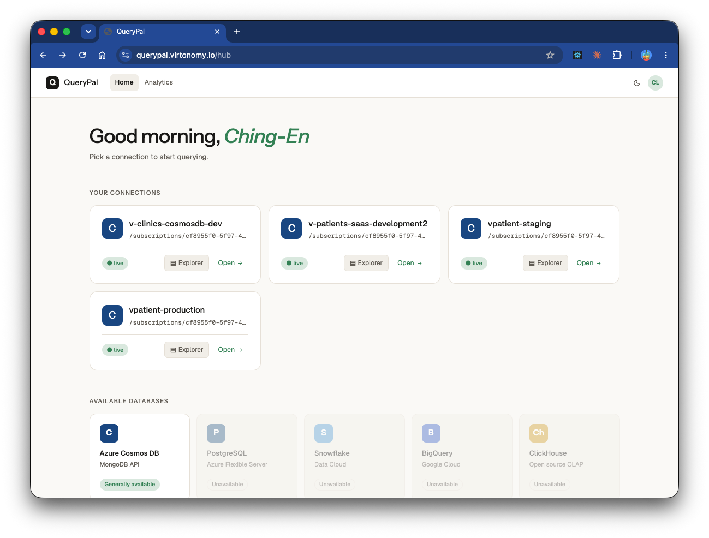
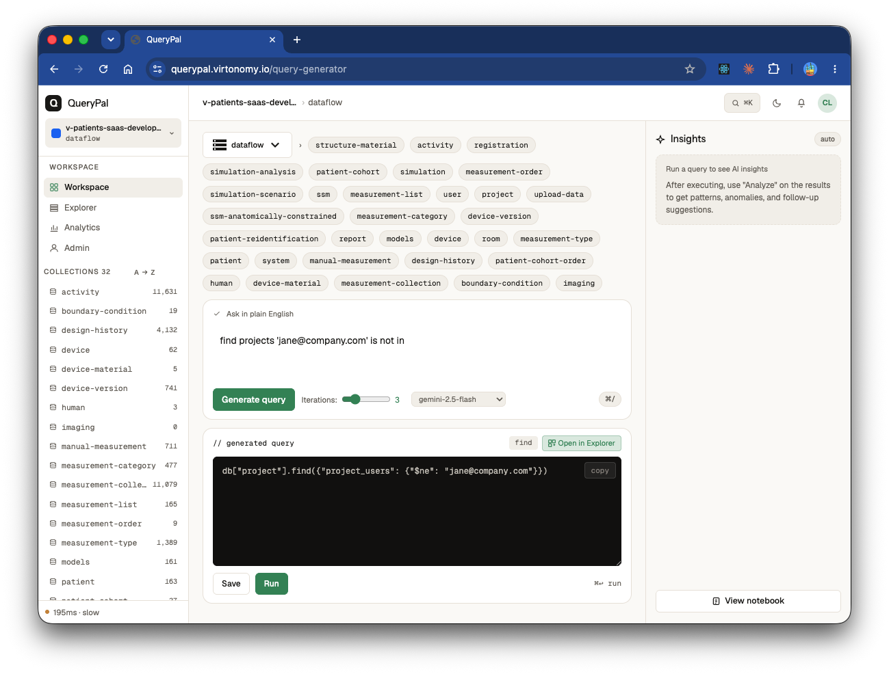
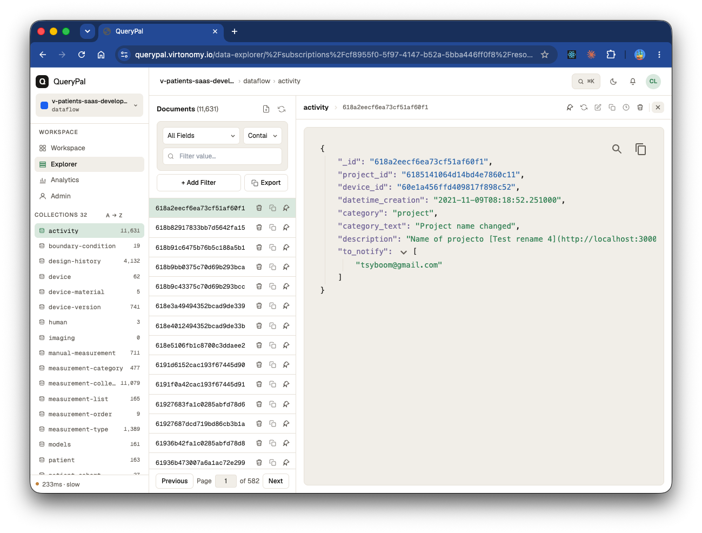
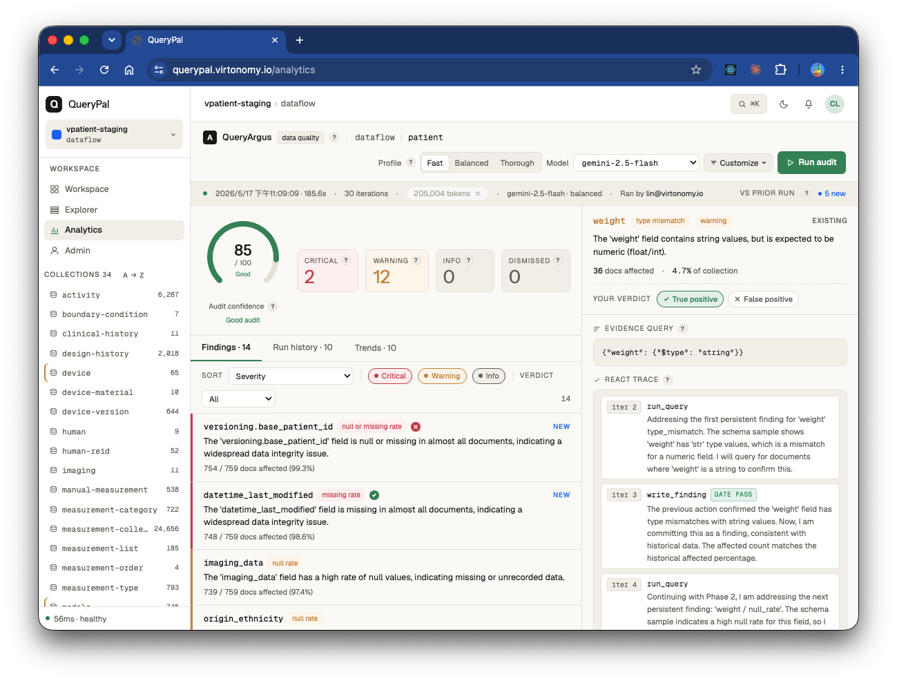
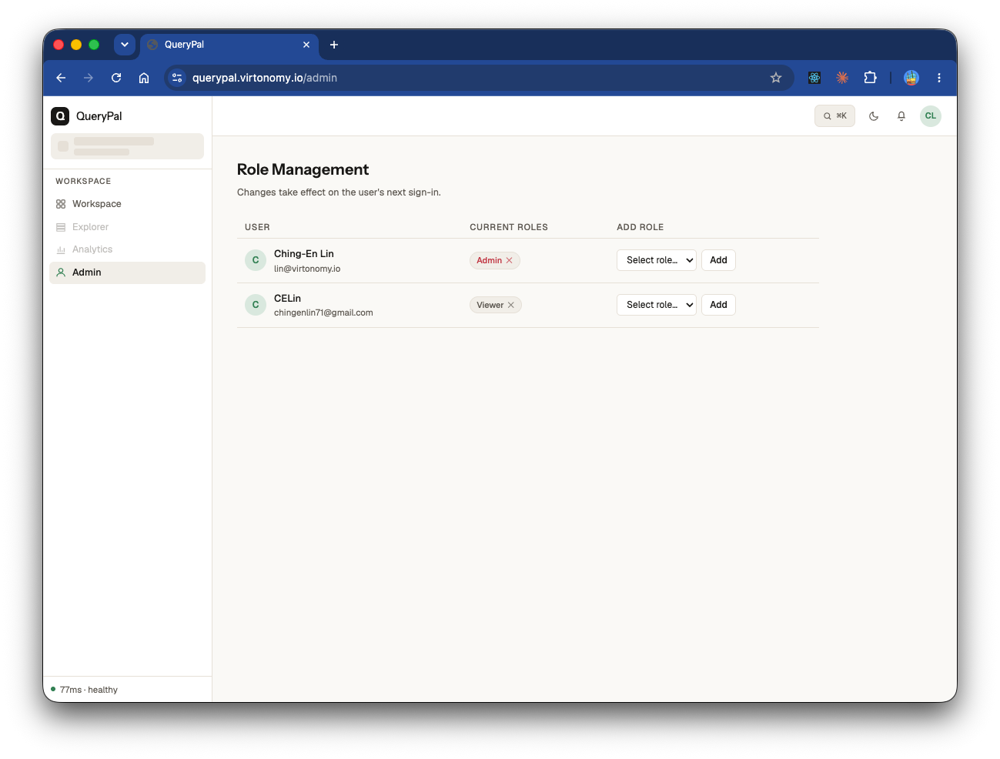

# QueryPal
### AI-Powered Database Assistant for Azure Cosmos DB

QueryPal lets you query, explore, and manage **Azure Cosmos DB (MongoDB API)** using natural language. Type a question, get an optimized MongoDB query and AI-generated analysis back.

**Key capabilities:**
- Natural language → MongoDB query via Google Gemini + LangGraph ReAct agent
- Cross-collection queries with automatic `$lookup` guidance and schema relationship inference
- Paginated data explorer with filtering, multi-select, and document editing
- Data quality analytics powered by [QueryArgus](https://github.com/ChingEnLin/QueryArgus) — configurable audit runs, live progress, per-user saved profiles
- Saved queries, audit trails, and schema relationship graph
- Role-based access control (RBAC): viewer / analyst / admin roles with JWT claim verification
- Admin UI for managing user roles
- Enterprise auth: Microsoft Entra ID with On-Behalf-Of (OBO) flow
- Private backend: frontend nginx proxies all API calls internally — backend is unreachable from the internet

---

## Screenshots

**Hub** — pick a Cosmos DB connection to start querying



**Query Generator** — describe what you need in plain English; the ReAct agent generates, tests, and refines the MongoDB query



**Data Explorer** — browse, filter, and edit documents with a resizable JSON panel



**Analytics** — run QueryArgus data-quality audits and review findings by severity



**Admin** — manage user roles (Admin, Analyst, Viewer) from the role management panel



---

## Tech Stack

| Layer | Technology |
|---|---|
| Frontend | React 18, TypeScript, Vite |
| Backend | FastAPI (Python 3.12), Pydantic V2 |
| AI | Google Gemini (`gemini-2.5-flash`), LangGraph |
| Auth | Microsoft Entra ID, MSAL, OBO flow |
| Databases | Azure Cosmos DB (MongoDB API), PostgreSQL (Cloud SQL) |
| Infrastructure | Google Cloud Run, Terraform, GCP Secret Manager, Serverless VPC Access |
| CI/CD | GitHub Actions, Docker, Google Container Registry |

---

## Quick Start

```bash
cp backend/.env.example backend/.env
# Fill in backend/.env — see docs/DEVELOPMENT.md for all variables
docker-compose up --build
```

- Frontend: http://localhost:5173
- Backend API: http://localhost:8000
- API docs: http://localhost:8000/docs

For dev without Azure, set `USE_MSAL_AUTH = false` in `frontend/app.config.ts` to use mock data.

---

## Documentation

| Doc | Contents |
|---|---|
| [Architecture](docs/ARCHITECTURE.md) | BFF pattern, auth flow, ReAct agent loop, security model |
| [Infrastructure](docs/INFRASTRUCTURE.md) | Cloud topology, network security, Secret Manager, Terraform setup, CI/CD pipeline |
| [Azure Setup](docs/AZURE_SETUP.md) | Entra ID app registrations, Cosmos DB permissions, frontend auth config |
| [Development](docs/DEVELOPMENT.md) | Local setup, testing commands, code style |
| [Design Handbook](DESIGN_HANDBOOK.md) | CSS tokens, utility classes, component conventions |
| [Versioning](docs/SEMANTIC_VERSIONING.md) | Semantic versioning and conventional commits |

---

## Links

- **Live**: https://querypal.virtonomy.io
- **Issues**: https://github.com/ChingEnLin/QueryPal/issues
- **License**: [MIT](LICENSE)

---

Built by [Ching-En Lin](https://github.com/ChingEnLin)
