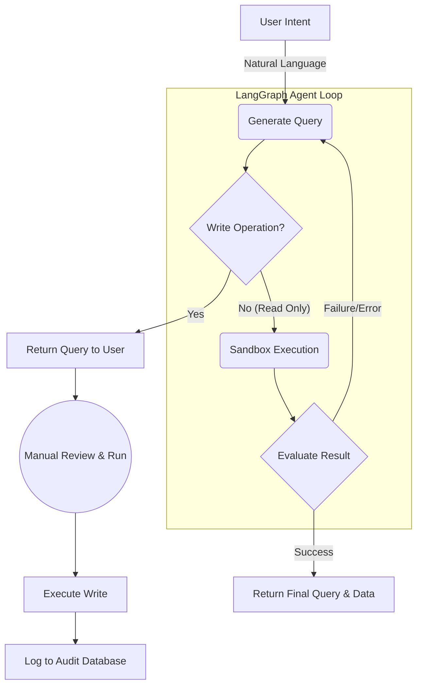

# Architecture

## Backend-for-Frontend (BFF) Pattern

QueryPal uses a BFF architecture where the FastAPI backend is the sole actor that touches Azure and database credentials. The browser only ever holds an MSAL access token.

```
┌─────────────────────┐     Auth       ┌─────────────────────┐
│    React Frontend   ├───────────────►│  Microsoft Entra    │
│   (SPA + MSAL.js)   │◄───────────────┤   Identity Platform │
└─────────────────────┘   Access Token └─────────────────────┘
           │
           ▼ Bearer Token
┌─────────────────────┐
│   FastAPI Backend   │
│  • Token Validation │
│  • OBO Exchange     │
│  • Query Processing │
│  • AI Integration   │
│  • Document CRUD    │
└─────────────────────┘
           │
           ├──────────────────────────────────────┐
           ▼                                      ▼
┌─────────────────────┐              ┌─────────────────────┐
│  Google Gemini API  │              │   Azure Cosmos DB   │
│  • NL2Query         │              │  • Document Storage │
│  • Data Analysis    │              │  • MongoDB API      │
└─────────────────────┘              └─────────────────────┘
           │
           ▼
┌─────────────────────┐
│   PostgreSQL DB     │
│  • User Queries     │
│  • Audit Logs       │
└─────────────────────┘
```

### Authentication Flow

1. Frontend acquires an access token from Microsoft Entra ID via MSAL (`api://<backend-client-id>/access_as_user` scope).
2. Frontend sends `Authorization: Bearer <token>` to the backend.
3. Backend performs an On-Behalf-Of (OBO) exchange to get an ARM-scoped token.
4. Backend uses the ARM token to fetch Cosmos DB accounts and connection strings from Azure Resource Manager.

---

## ReAct Agent Loop

QueryPal uses a LangGraph-based ReAct agent to autonomously generate, sandbox-test, and evaluate MongoDB queries. Write operations are detected via AST (not regex) and returned to the user for manual review rather than executed automatically.



**Agent nodes:** `generate_query → execute_test → evaluate_result → (loop or end)`

- Max iterations enforced server-side via `max_iterations` in `QueryPrompt` (default 3, max 10).
- Sandbox scope is locked to `{"db": db, "ObjectId": ObjectId}` — no arbitrary code execution.
- Write operations (`insert_one`, `update_*`, `delete_*`, etc.) are AST-detected and never executed in the sandbox.

---

## RBAC & JWT Verification

QueryPal enforces role-based access control using claims decoded directly from the MSAL JWT on every request — no separate session store.

**Roles:** `viewer` (read-only), `analyst` (read + run audits), `admin` (all + role management)

**Flow:**
1. Backend decodes the bearer token and extracts `roles` claim (populated by Entra ID app role assignments).
2. Route dependencies (`require_role(...)`) raise `403` if the caller lacks the required role.
3. Caller identity (`preferred_username` / `email` claim) scopes audit reports and saved profiles per user.

**UI enforcement:** The frontend reads roles from the decoded token via `useRoles()`. Viewer users see the Run Audit button and verdict controls (TP/FP) disabled. The Admin page is only linked for users with the `admin` role.

---

## QueryArgus Data Quality

The Analytics page runs [QueryArgus](https://github.com/ChingEnLin/QueryArgus) data-quality audits via `backend/routes/argus.py`.

**Persistence:** Every report is written to PostgreSQL via `ReportStore`. Schema is applied lazily on first call to `get_report_store()` (`init_schema()` from upstream + additive `created_by` column + `argus_profiles` table). Storage is optional — when DB vars are absent the store returns `None` and runs still complete in-memory.

**Profiles & overrides:** Three built-in presets (`fast` / `balanced` / `thorough`). Per-run `argus_overrides` and `config_overrides` merge onto the preset baseline. Power users can save override sets as named profiles in `argus_profiles` (unique per `user_email`); inline overrides take precedence over saved profiles for a given run.

**Access scoping:** Reports are filtered by `cosmos_account` against the caller's accessible Azure accounts (via OBO). Cross-tenant fetches return `404` (not `403`) to avoid leaking existence.

**Live progress:** Structured observers emit progress events during a run; the frontend polls `GET /argus/jobs/{job_id}` to stream updates in real time.

---

## Security Model

| Layer | Mechanism |
|---|---|
| Browser → Backend | MSAL Bearer token, validated on every request |
| Role enforcement | JWT `roles` claim decoded per request; `require_role()` dependency raises `403` |
| Backend → Azure | OBO token exchange, never stored |
| Backend → Cosmos DB | ARM-fetched connection string, scoped per request |
| Secrets at rest | GCP Secret Manager, mounted at container startup |
| Backend network | `--ingress=internal` — unreachable from public internet |
| Frontend → Backend | nginx proxy over VPC connector — backend URL never exposed to browser |
