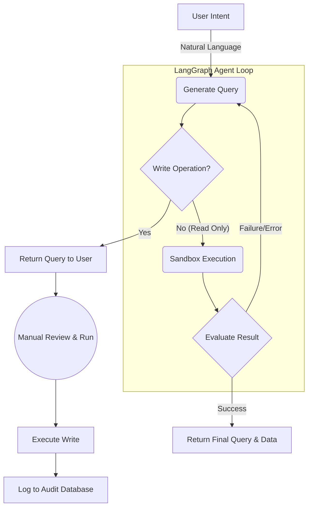

# Architecture

## Backend-for-Frontend (BFF) Pattern

QueryPal uses a BFF architecture where the FastAPI backend is the sole actor that touches Azure and database credentials. The browser only ever holds an MSAL access token.

```
┌─────────────────────┐     Auth       ┌─────────────────────┐
│    React Frontend   ├───────────────►│  Microsoft Entra    │
│   (SPA + MSAL.js)   │◄───────────────┤   Identity Platform │
└─────────────────────┘   Access Token └─────────────────────┘
           │
           ▼ Bearer Token
┌─────────────────────┐
│   FastAPI Backend   │
│  • Token Validation │
│  • OBO Exchange     │
│  • Query Processing │
│  • AI Integration   │
│  • Document CRUD    │
└─────────────────────┘
           │
           ├──────────────────────────────────────┐
           ▼                                      ▼
┌─────────────────────┐              ┌─────────────────────┐
│  Google Gemini API  │              │   Azure Cosmos DB   │
│  • NL2Query         │              │  • Document Storage │
│  • Data Analysis    │              │  • MongoDB API      │
└─────────────────────┘              └─────────────────────┘
           │
           ▼
┌─────────────────────┐
│   PostgreSQL DB     │
│  • User Queries     │
│  • Audit Logs       │
└─────────────────────┘
```

### Authentication Flow

1. Frontend acquires an access token from Microsoft Entra ID via MSAL (`api://<backend-client-id>/access_as_user` scope).
2. Frontend sends `Authorization: Bearer <token>` to the backend.
3. Backend performs an On-Behalf-Of (OBO) exchange to get an ARM-scoped token.
4. Backend uses the ARM token to fetch Cosmos DB accounts and connection strings from Azure Resource Manager.

---

## ReAct Agent Loop

QueryPal uses a LangGraph-based ReAct agent to autonomously generate, sandbox-test, and evaluate MongoDB queries. Write operations are detected via AST (not regex) and returned to the user for manual review rather than executed automatically.



**Agent nodes:** `generate_query → execute_test → evaluate_result → (loop or end)`

- Max iterations enforced server-side via `max_iterations` in `QueryPrompt` (default 3, max 10).
- Sandbox scope is locked to `{"db": db, "ObjectId": ObjectId}` — no arbitrary code execution.
- Write operations (`insert_one`, `update_*`, `delete_*`, etc.) are AST-detected and never executed in the sandbox.

---

## Security Model

| Layer | Mechanism |
|---|---|
| Browser → Backend | MSAL Bearer token, validated on every request |
| Backend → Azure | OBO token exchange, never stored |
| Backend → Cosmos DB | ARM-fetched connection string, scoped per request |
| Secrets at rest | GCP Secret Manager, mounted at container startup |
| Backend network | `--ingress=internal` — unreachable from public internet |
| Frontend → Backend | nginx proxy over VPC connector — backend URL never exposed to browser |
