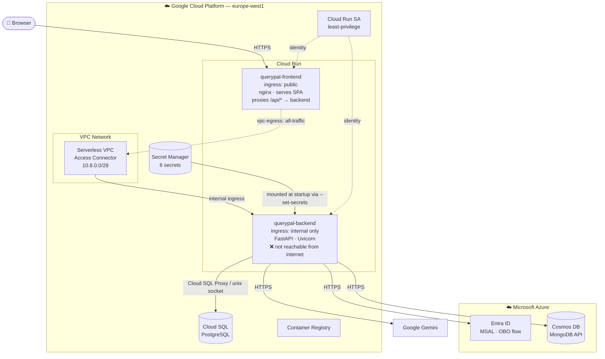
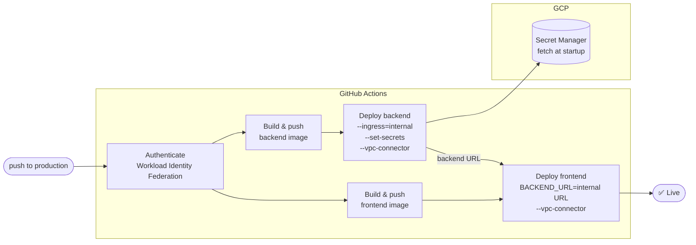

# Infrastructure & Deployment

## Production Topology

The frontend nginx container is the only public entry point. The backend is network-isolated and unreachable from the internet — all browser traffic goes to `/api/*` on the frontend's origin, which nginx proxies internally through the VPC connector.



## Network Security

| | Frontend | Backend |
|---|---|---|
| Cloud Run ingress | `all` (public) | `internal` (VPC only) |
| VPC egress | `all-traffic` | `private-ranges-only` |
| Internet accessible | Yes | No — 403 from GFE |
| Who can call it | Anyone | Frontend nginx via VPC connector |

---

## Secret Management

All sensitive configuration lives in **GCP Secret Manager** and is mounted into the backend container at startup via `--set-secrets`. Secrets are never passed as plain environment variables and never appear in `gcloud run describe` output.

| Secret ID | Description |
|---|---|
| `querypal-azure-tenant-id` | Microsoft Entra ID tenant |
| `querypal-azure-client-id` | Backend app registration client ID |
| `querypal-azure-client-secret` | Backend app registration client secret |
| `querypal-gemini-api-key` | Google Gemini API key |
| `querypal-db-user` | Cloud SQL PostgreSQL username |
| `querypal-db-pass` | Cloud SQL PostgreSQL password |

---

## Terraform

Cloud infrastructure is managed by Terraform in `terraform/`. The CI pipeline owns image builds and Cloud Run deployments; Terraform owns everything underneath.

| Resource | Owner |
|---|---|
| VPC connector | Terraform |
| Secret Manager secrets | Terraform |
| Cloud Run service account + IAM | Terraform |
| Cloud SQL instance & database | Terraform (imported existing) |
| Cloud Run services | CI pipeline |
| Docker images | CI pipeline |

### First-time setup

```bash
cd terraform
cp terraform.tfvars.example terraform.tfvars
terraform init
./import.sh      # import existing Cloud SQL — no data migration needed
terraform apply
```

After apply, populate Secret Manager before triggering any deployment:

```bash
for SECRET_ID in querypal-azure-tenant-id querypal-azure-client-id querypal-azure-client-secret querypal-gemini-api-key querypal-db-user querypal-db-pass; do
  echo -n "Enter value for ${SECRET_ID}: "
  read -rs VALUE && echo
  echo -n "${VALUE}" | gcloud secrets versions add "${SECRET_ID}" --data-file=-
done
```

---

## CI/CD Pipeline

Pushes to the `production` branch (or manual `workflow_dispatch`) trigger `.github/workflows/google-cloudrun-docker.yml`.



Authentication uses Workload Identity Federation — no long-lived service account keys are stored in GitHub. The `querypal-cloudrun-sa` service account holds only the permissions it needs: `secretmanager.secretAccessor`, `cloudsql.client`, and `vpcaccess.user`.
